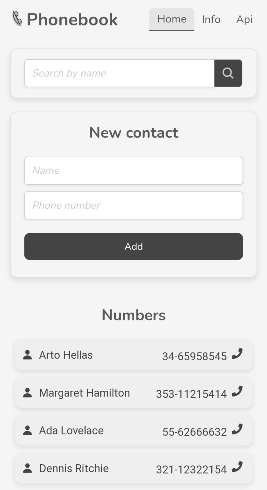
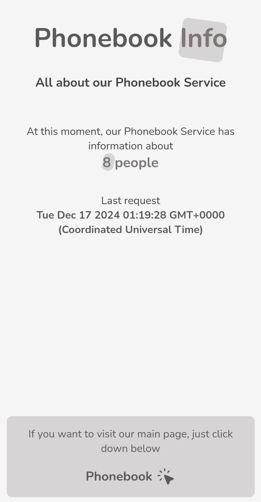
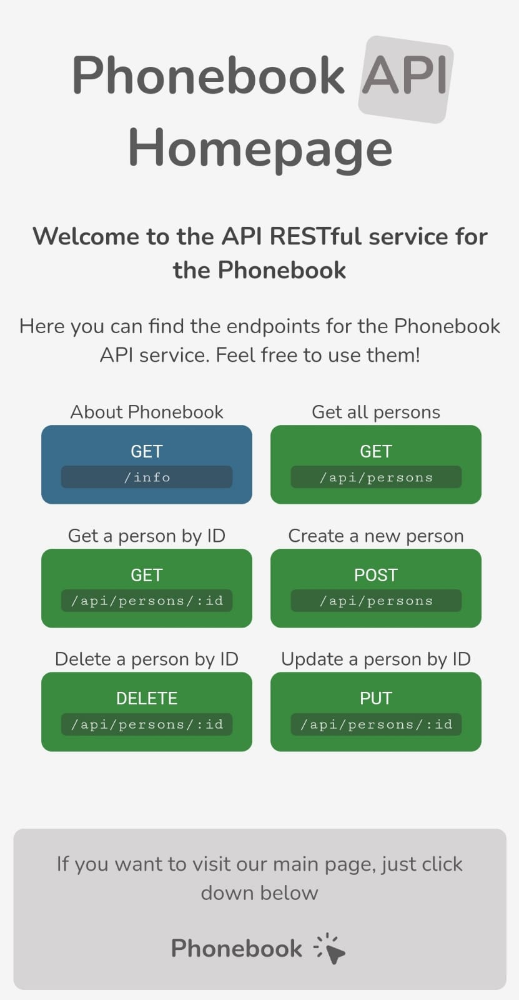
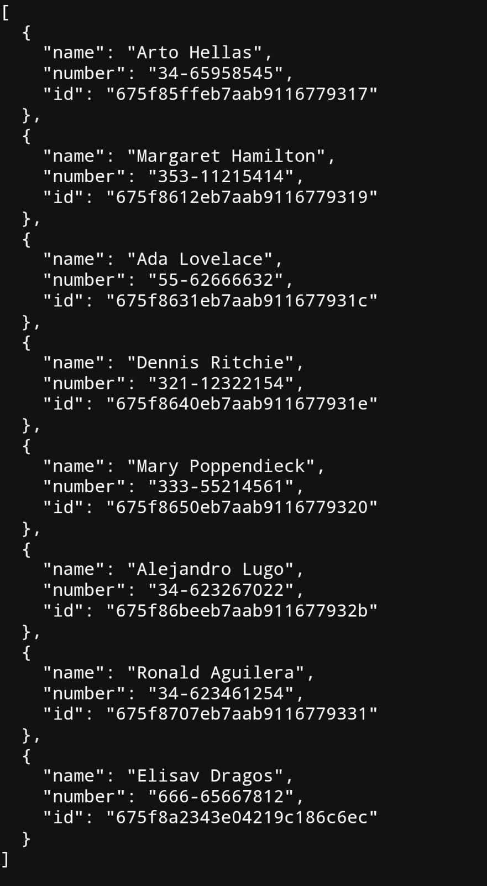

# Phonebook API

This is the backend server for the Phonebook app. It runs on port 3000, by using Express.js and some other technologies.

You can find the deployed version of the app at [https://phonebook-server-aggiovato.fly.dev/](https://phonebook-server-aggiovato.fly.dev/)

## Endpoints

  
  
  
  

### GET /

Get the home page. Dist is the folder where the compiled files are located.

[https://phonebook-server-aggiovato.fly.dev/](https://phonebook-server-aggiovato.fly.dev/)

### GET /info

Get information about the Phonebook
[https://phonebook-server-aggiovato.fly.dev/info](https://phonebook-server-aggiovato.fly.dev/info)

### GET /api/

Get the API homepage
[https://phonebook-server-aggiovato.fly.dev/api/](https://phonebook-server-aggiovato.fly.dev/api/)

### GET /api/persons

Get all persons
[https://phonebook-server-aggiovato.fly.dev/api/persons](https://phonebook-server-aggiovato.fly.dev/api/persons)

## Requests

You can find the requests in the `requests` folder.

## License

This project is licensed under the MIT License - see the [LICENSE](LICENSE) file for details.
